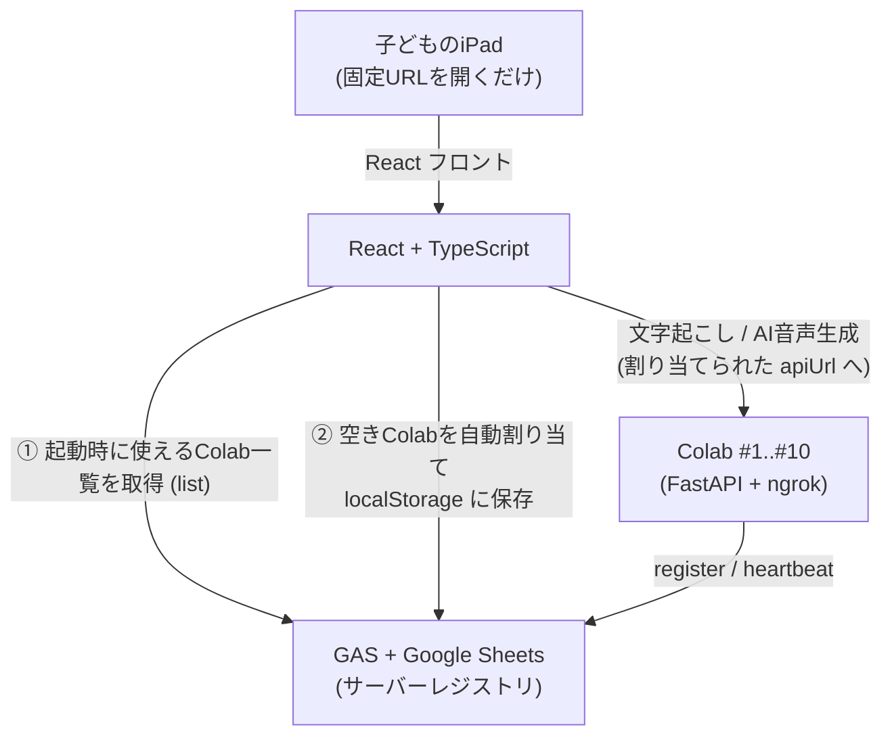
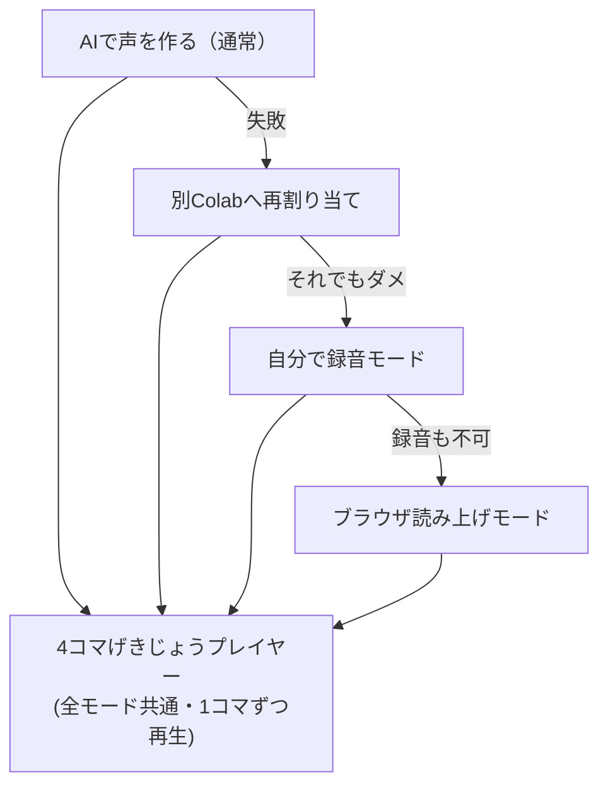

# 声つき4コマ劇場 🎤📖

小学生向けイベント用 Web アプリ。
iPad でアプリを開き、**4コマ漫画を作り → 自分の声を録音 → AI音声を生成 → 4コマ劇場として再生**するまでを、子どもが迷わず進められるステップ形式で実現します。



---

## 構成（monorepo）

```
voice-comic-theater/
├── frontend/        React + TypeScript（Vite）。子ども用UI＋先生用 /admin
│   ├── src/
│   │   ├── steps/       ステップUI（えをえらぶ→…→4コマげきじょう）
│   │   ├── lib/         registry(GAS) / api(FastAPI) / recorder / speech / storage
│   │   ├── admin/       先生・TA用 管理画面
│   │   └── ...
│   ├── public/panels/   20枚のダミーパネル画像 + manifest.json（差し替え可）
│   └── scripts/         パネル画像ジェネレーター
├── backend/         FastAPI。adapter層でWhisper/QwenTTSに差し替え可
│   └── app/
│       ├── routes/      /health /transcribe /generate-comic-voices /files /cleanup
│       ├── services/    audio(ffmpeg) / transcription / tts（サービス層）
│       └── adapters/    dummy / whisper / qwen（adapter層）
├── colab/           Colabでバックエンドを起動するコード（runner + notebook）
├── gas/             Google Apps Script（サーバーレジストリ）
└── docs/            セットアップ・運用ドキュメント
```

詳しい手順は [`docs/`](./docs) にあります。

| ドキュメント | 内容 |
|---|---|
| [docs/01-development.md](docs/01-development.md) | 開発環境の起動方法 |
| [docs/02-ngrok-ipad.md](docs/02-ngrok-ipad.md) | ngrok を使って iPad から確認する方法 |
| [docs/03-colab-backend.md](docs/03-colab-backend.md) | Colab でバックエンドを起動する方法 |
| [docs/04-gas-sheets.md](docs/04-gas-sheets.md) | GAS + Google Sheets の準備方法 |
| [docs/05-event-operations.md](docs/05-event-operations.md) | 本番当日の運用手順 |
| [docs/06-fallback.md](docs/06-fallback.md) | Colab が落ちた時のフォールバック手順 |
| [docs/07-child-voice-notes.md](docs/07-child-voice-notes.md) | 子どもの声を扱う上での注意事項 |

---

## 1. 起動方法

### フロントエンド（React）

```bash
npm install            # ルートで一度だけ（workspace）
cp frontend/.env.example frontend/.env   # VITE_GAS_URL を設定
npm run dev            # http://localhost:5173
```

### バックエンド（FastAPI / ローカル開発）

```bash
cd backend
python3 -m venv .venv && . .venv/bin/activate
pip install -r requirements.txt
uvicorn app.main:app --reload --host 0.0.0.0 --port 8000
# http://localhost:8000/health
```

最初は **ダミー実装** で動きます（文字起こし＝サンプル文、AI音声＝コマごとに違うトーン音）。
`React → FastAPI → 音声ファイル返却 → 4コマ劇場再生` の流れがそのまま確認できます。

### パネル画像の差し替え

ダミー20枚は `frontend/public/panels/` にあります。
本番では実画像を置き、`manifest.json`（`{id, src, label}` の配列）を更新するだけで差し替わります。
再生成は `npm run panels`。

---

## 2. 開発中に ngrok で公開する方法

開発中、iPad から実機確認するには ngrok でトンネルを張ります。詳細は [docs/02-ngrok-ipad.md](docs/02-ngrok-ipad.md)。

```bash
# フロントを公開（Vite は allowedHosts を許可済み）
npm run ngrok:front      # = ngrok http 5173

# バックを公開
npm run ngrok:back       # = ngrok http 8000
```

- 本番では **フロントは固定URLでホスティング**し、**バックエンドだけ Colab + ngrok** で公開します。
- ブラウザ録音（マイク）は **HTTPS が必須**です。ngrok / ホスティングはどちらも HTTPS なので問題ありません。

---

## 3. iPad で動作確認する方法

1. iPad と PC を同じネットワークにするか、ngrok の HTTPS URL を使う。
2. iPad の Safari でフロントの URL を開く（**QRは必須ではありません**。固定URLを開くだけ）。
3. 予備として共通QRを配ってもOK（同じURLを指すだけ）。
4. 画面上部に **「あなたは ○サーバー です」** と接続先の色が表示されます。
5. マイク許可のダイアログが出たら「許可」。
6. 詳細・トラブルシュートは [docs/02-ngrok-ipad.md](docs/02-ngrok-ipad.md)。

---

## 4. Colab を 5〜10台起動する本番運用

1台のColab = 1サーバー。台ごとに `SERVER_ID` / `SERVER_COLOR` を変えて起動します。
色は10色（赤・青・緑・黄・紫・オレンジ・ピンク・水色・茶色・黒）。**台数は固定ではなく、5台でも10台でも動きます**。

```python
# Colab の最後のセル（詳細は colab/start_backend.ipynb）
import os
os.environ['GAS_URL']      = userdata.get('GAS_URL')   # 直書きしない
os.environ['TUNNEL']       = 'cloudflare'              # 本番は Cloudflare（無料・鍵不要・複数台OK）
os.environ['SERVER_ID']    = 'colab-1'
os.environ['SERVER_COLOR'] = 'red'
os.environ['SERVER_LABEL'] = '赤サーバー'
os.environ['CAPACITY']     = '2'        # 1台 1〜2人
%run colab/colab_runner.py
```

`colab_runner.py` が **依存インストール → FastAPI起動 → トンネル公開 → GAS登録 → heartbeat送信** まで自動で行います。

**公開トンネルは2種類**（`TUNNEL` で切替。GASがURLを仲介するのでフロントは無修正）:
- `cloudflare`（本番おすすめ）: 無料・アカウント/鍵不要・**複数台同時OK**・警告ページ無し。`cloudflared` を自動取得して `*.trycloudflare.com` を発行。
- `ngrok`（手元の確認向き）: 1アカウント＝同時1トンネル。`NGROK_AUTHTOKEN` が必要。

手順の全体は [docs/03-colab-backend.md](docs/03-colab-backend.md) と [docs/05-event-operations.md](docs/05-event-operations.md)。

---

## 5. GAS への自動登録の流れ

GAS + Google Sheets を**簡易サーバーレジストリ**として使います（外部DBは使いません）。
Sheets の列: `serverId | color | label | apiUrl | enabled | capacity | assignedCount | lastSeen`

1. **register**: Colab 起動時、`colab_runner.py` がトンネルの公開URL（Cloudflare/ngrok）を GAS に登録（`apiUrl` 保存・`assignedCount=0`・`lastSeen` 更新）。
2. **heartbeat**: 一定間隔（既定30秒）で `lastSeen` を更新。生きているサーバーだけが「新しい」状態になる。
3. **list**: React 起動時に `?action=list` で一覧取得。
4. **assign**: 割り当て確定時に `assignedCount` を +1。

準備手順は [docs/04-gas-sheets.md](docs/04-gas-sheets.md)。

---

## 6. localStorage による割り当て保存の仕組み

端末（iPad）ごとの接続先を localStorage に保存します（キー: `vct.assignment`）。

- **起動時**: 保存済み接続先があれば、その `apiUrl/health` を確認 → 通れば**それを優先**して使う。
- **無い／死んでいる場合**: GAS から一覧を取り直し、`enabled=true` かつ `assignedCount < capacity` かつ `lastSeen` が新しいサーバーの中から、**空きが多い順**に1台選び、`/health` が通るものを割り当てて保存。
- **接続失敗時**: 直前のサーバーを除外して**別のColabへ再割り当て**。
- 保存内容: `{ serverId, color, label, apiUrl, assignedAt }`。

選定ロジックは `frontend/src/lib/registry.ts`、保存は `frontend/src/lib/storage.ts`。

---

## 7. フォールバックモードの使い方

すべてのColabが使えない、AI音声生成が失敗する、といった場合に備えて2つの保険があります。
切り替えは先生用 **管理画面（右上の小さな⚙ → `/admin`）** から、または接続失敗時のバナーから行えます。

1. **自分で録音モード（`self-record`）**
   AI音声を使わず、各コマのセリフを**子ども自身の声で録音**して作品を完成させます。
2. **ブラウザ読み上げモード（`browser-tts`）**
   `speechSynthesis` を使い、**端末標準の読み上げ音声**でセリフを再生します。録音もネットも不要。

どちらのモードでも、最後の「4コマげきじょう」プレイヤーで1コマずつ順番に再生できます。



詳細は [docs/06-fallback.md](docs/06-fallback.md)。

---

## テスト・Lint・CI

```bash
# フロントエンド（Vitest / ESLint / tsc）
npm run test:run --workspace frontend     # ユニットテスト
npm run lint --workspace frontend         # ESLint
npm run typecheck --workspace frontend    # 型チェック

# バックエンド（pytest / ruff）
cd backend && . .venv/bin/activate
pip install -r requirements-dev.txt
pytest                # API・サービス層のテスト
ruff check .          # lint
ruff format --check . # フォーマット確認
```

- フロント: `colors` / `rankServers`（割り当てロジック）/ `storage` / `config` / `ServerBadge` をテスト。
- バック: `/health` `/transcribe` `/generate-comic-voices`(4ファイル生成・lock解放) `/files`(配信・パストラバーサル防御) `/cleanup`、ダミーTTSのwav生成をテスト。
- **GitHub Actions**（`.github/workflows/ci.yml`）が push / PR で frontend・backend 両ジョブを自動実行します。
- GAS の動作確認は `bash scripts/test-gas.sh <GAS_URL>`（register→list→assign→heartbeat→list）。

## 技術構成

| 項目 | 採用 |
|---|---|
| フロントエンド | React + TypeScript（Vite） |
| バックエンド | FastAPI |
| AI実行環境 | Google Colab |
| 開発中の外部公開 | ngrok |
| Colabサーバー管理 | GAS + Google Sheets |
| 端末ごとの接続先保存 | localStorage |
| 外部DB | 使わない |

- 文字起こし: 最初は **dummy**、`.env` の `TRANSCRIBE_BACKEND=whisper` で Whisper に差し替え（`adapters/whisper_transcriber.py`）。
- 音声生成: 最初は **dummy**、`.env` の `TTS_BACKEND=qwen` で QwenTTS に差し替え（`adapters/qwen_tts.py`）。サービス層／adapter層に分離済み。
- 1つのColabでは `asyncio.Lock`（`backend/app/locks.py`）により**音声生成を1件ずつ順番に処理**します。
